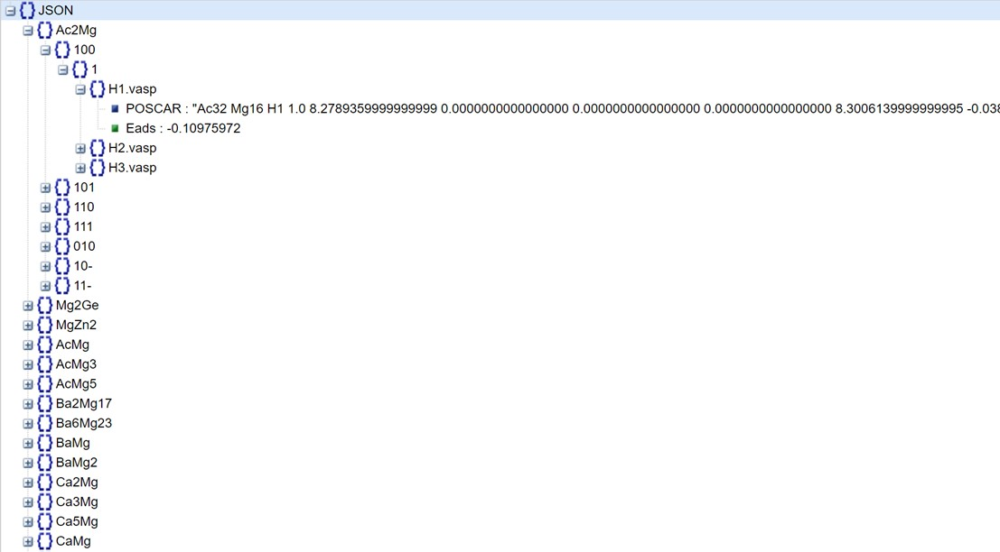
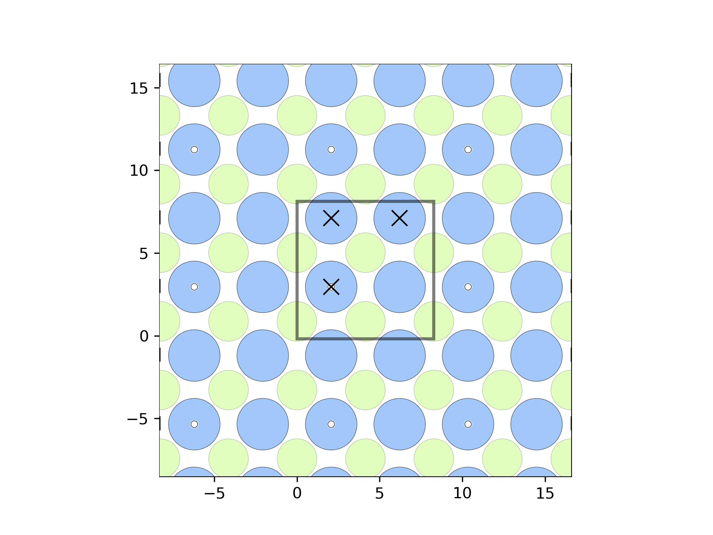

# Mg Corrosion DFT data

This is a Mg corrosion related database, which include arouond 100k different H adosprtion structures on the Mg intermetallic phases and their corresponding predicted H adsorption energy.

# Table of Contents

- [Database](#Database)
- [Download](#Download)
- [Use the code](#Use-the-code)
- [References](#reference)
- [Acknowledgement](#Acknowledgement)

# Database
Their is the sub databbase in the 'data' directory. Due to the size limit for file uploads on GitHub, the complete dataset (around 1.33 GB) can be downloaded on Google Drive, which is avalable at [Here](https://drive.google.com/file/d/12ixEDfre9fCH5Bzj6DQJ7tNa1DR2zNsL/view?usp=sharing). The structure of the database is



# Download
If you want to download this repository, please use following command.
```bash
git clone https://github.com/ywwang0/Mg-Corrosion-DFT-data.git
```

# Using the dataset
## Load the data set
```python
import json
with open('data/result_filter.json', 'r') as f:
    for line in f:
        filtered_data = json.loads(line)
```
## Visulise the adsotption sites and predicted adsorption energy
```python
from utlis.structure import show_adsoprtion_site
show_adsoprtion_site(filtered_data, 'Ac2Mg','100','1','H1.vasp')

>>> The predicted H adsorption energy on this site is:-0.11 eV
```

## Save the structure you are interested in
```python
from utlis.structure import save_structure
adsorption_structure = save_structure(filtered_data, "Mg2Ge", "100", "1", "H1.vasp")
```
## Predict the H adsorption energy for a new adsorption structure
```python
from utlis.ActiveLearningPred import predict
predict('Mg2Ge_100_1_H1.vasp')

>>> The predicted H adsorption energy for the input adsorption strucutre is: 0.55 eV
```

# References
Accelerated discovery of magnesium intermetallic compounds with sluggish corrosion cathodic reactions through active learning and DFT calculations
Yaowei Wanga, Qingli Tanga, Xinchen Xub, Paul Wenga, Tao Yingb, Yao Yangb , Xiaoqin Zengb, Hong Zhua,b

# Acknowledgement
The research was financially supported by the National Key R&D Program (No. No. 2021YFB3501002) supported by the Ministry of Science and Technology of China, National Natural Science Foundation of China (No. 51825101, 52127801). First-principles calculations were carried out on the π 2.0 cluster supported by the Center for High Performance Computing at Shanghai Jiao Tong University.
